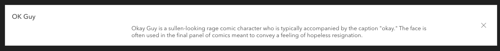
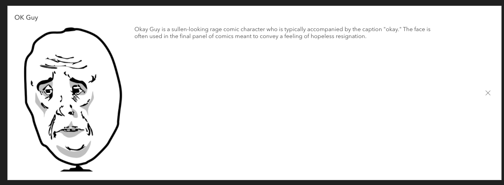

<!-- .slide: data-background="../node_modules/esri-reveal.js-templates/img/2021/dev-summit/bg-1.png" data-background-size="cover" -->

# Esri's Design System

#### Build Compelling Web Apps Faster Using the New Web Component Library

<h2><calcite-avatar scale="l" full-name="Matt Driscoll" thumbnail="./img/matt.jpeg"></calcite-avatar> Matt Driscoll – <a href="https://twitter.com/driskull" target="_blank">@driskull</a></h2>

<h2><calcite-avatar scale="l" full-name="JC Franco" thumbnail="./img/jc.jpg"></calcite-avatar> JC Franco – <a href="https://twitter.com/arfncode" target="_blank">@arfncode</a></h2>

---

<!-- .slide: data-background="../node_modules/esri-reveal.js-templates/img/2021/dev-summit/bg-3.png" data-background-size="cover"  -->

## Agenda

- Calcite Introduction
- Benefits
- Docs & demos
- Getting started
- Demo apps
- Custom theming
- Examples in the wild

---

<!-- .slide: data-background="../node_modules/esri-reveal.js-templates/img/2021/dev-summit/bg-3.png" data-background-size="cover"  -->

# Introduction

Getting to know Calcite components

---

## Calcite - Esri's design system

- Visual language
  - Design standards
    - Color, Spacing, Typography...
  - Documentation
  - Principles
  - Patterns
  - etc...
- Closes the gap between designers and UI engineers

---

<calcite-notice icon active scale="m" width="half" color="yellow">
  <div slot="notice-title">*disclaimer</div>
  <div slot="notice-message">we are <strong><u>not</u></strong> designers</div>
</calcite-notice>

---

<!-- .slide: data-background="../node_modules/esri-reveal.js-templates/img/2021/dev-summit/bg-2.png" data-background-size="cover"  -->

## Calcite components

- Web Components for Esri's Calcite Design System
  - Provides a library of patterns
  - Ready-to-use, reusable
  - Easily build consistent Esri-branded apps
  - 50+ web components
  - Internal & external use
  - [Developer subscription](https://www.esri.com/en-us/arcgis/products/arcgis-developers/overview) required
  - Shared source

---

<!-- .slide: data-background="../node_modules/esri-reveal.js-templates/img/2021/dev-summit/bg-3.png" data-background-size="cover"  -->

# Benefits

Why use Calcite components?

---

## Consistency

- Consistent UX
  - Esri branded
  - Identity (Look & feel)
  - Principles
  - Best practices
  - Conventions
- Clear direction for designers & developers

---

## Efficiency

- Reduced Effort & cost
  - Ease Esri apps follow agreed upon designs workflows
  - Reduce cost of design updates
  - Reusable
    - DRY (Don't repeat yourself)
    - No more reinventing the wheel
- Speed up development timelines

---

## Accessibility

- Follows [WCAG](https://www.w3.org/WAI/standards-guidelines/wcag/) (a11y guidelines)
  - Semantics
  - Keyboard access
  - Color contrast
  - Text alternatives
- Continuous Integration (CI) using [axe API](https://www.deque.com/)

---

## Standards-based

- Web components
  - W3C specification (Future proof)
  - Encapsulation (Shadow DOM)
  - Familiarity (HTML)
  - Framework agnostic (Can be used in any framework)

---

## Browser Support

<table>
  <thead>
    <tr>
      <th><h4>Chrome</h4></th>
      <th><h4>Firefox</h4></th>
      <th><h4>Safari</h4></th>
      <th><h4>Edge</h4></th>
    </tr>
  </thead>
  <tbody>
    <tr>
      <td colspan="4">Last 2 versions ✔</td>
    </tr>
  </tbody>
</table>

---

<!-- .slide: data-background="../node_modules/esri-reveal.js-templates/img/2021/dev-summit/bg-3.png" data-background-size="cover"  -->

# Docs & demos

A tour of the Calcite developer documentation

---

## Calcite components

<ul>
  <li>
    Calcite Colors
    <ul>
      <li>All Esri colors</li>
      <li>Light/Dark theme</li>
    </ul>
  </li>
  <li>
    Calcite tailwind
    <ul>
      <li>Animations</li>
      <li>Spacing scale</li>
      <li>Shadows</li>
      <li>Font scale</li>
    </ul>
  </li>
  <li>
  Calcite UI icons
  <ul>
    <li>700+ icons</li>
  </ul>
</li>
</ul>

---

## Calcite UI Icons

- todo

---

## Calcite Colors

- todo

---

## Calcite Tailwind

- todo

---

<!-- .slide: data-background="../node_modules/esri-reveal.js-templates/img/2021/dev-summit/bg-3.png" data-background-size="cover"  -->

# Getting Started

Using Calcite components for your projects

---

## Web components

- Web standard
- APIs
- Tooling
  - [Stencil](https://stenciljs.com/)
  - [Tailwind CSS](https://tailwindcss.com/) (Our design tokens)

---

## Web Components (what?)

- Suite of different technologies
- Allows you to create reusable custom elements
  - Functionality encapsulated
  - Utilize them in your web apps
- Built on web standards
- Supported by modern browsers

---

## Web Components (how?)

- Custom elements
  - Allow you to create HTML elements that the browser can work with
  - Lifecycle
    - `constructor`
    - `connectedCallback`
    - `disconnectedCallback`
    - `adoptedCallback`
    - `attributeChangedCallback`
- Shadow DOM
  - `<slot>`
- HTML templates

---

## Web Components (why?)

- Modularity
- Encapsulation
- Reusability
- Framework-agnostic\* ([most frameworks anyways 😅](https://custom-elements-everywhere.com/))

---

## Get the components

- [NPM](https://www.npmjs.com/package/@esri/calcite-components) / [Yarn](https://yarnpkg.com/package/@esri/calcite-components)
- [CDN](https://js.arcgis.com/calcite-components/)

---

## Plug & Play

- Use as native HTML elements

```html
<div class="example">
  <h4>native</h4>
  <label>
    Name (4 to 8 characters):
    <input
      type="text"
      minlength="4"
      maxlength="8"
      placeholder="John Doe"
      required
    />
  </label>
</div>

<div class="example">
  <h4>calcite</h4>
  <calcite-label layout="inline">
    Name (4 to 8 characters):
    <calcite-input
      min-length="4"
      max-length="8"
      placeholder="John Doe"
      required
    ></calcite-input>
  </calcite-label>
</div>
```

[Demo](https://codepen.io/jcfranco-the-scripter/pen/BaQeOzr?editors=1000)

---

## Configuring components

- Slots
- Properties
- Attributes

---

## Slots

Components provide slots to customize certain regions

```html
<calcite-tip heading="My Tip">
  Okay Guy is a sullen-looking rage comic character...
</calcite-tip>
```



---

## Slots

Components provide slots to customize certain regions

```html
<calcite-tip heading="My Tip">
  
  Okay Guy is a sullen-looking rage comic character...
</calcite-tip>
```



---

## Themes

- `theme="dark"`

---

## RTL

- Right-to-left support
- `dir="rtl"`

---

## Internationalization

Component text is customizable via `intl` attributes/properties


---

## Internationalization

Component text is customizable via `intl` attributes/properties

```html
<calcite-modal ...> ... </calcite-modal>
```


---

## Internationalization

Component text is customizable via `intl` attributes/properties

```html
<calcite-modal ... intl-close="Cerrar"> ... </calcite-modal>
```


---

<!-- .slide: data-background="../node_modules/esri-reveal.js-templates/img/2021/dev-summit/bg-3.png" data-background-size="cover"  -->

# Demo: Getting started

---

<!-- .slide: data-background="../node_modules/esri-reveal.js-templates/img/2021/dev-summit/bg-3.png" data-background-size="cover"  -->

# Create Esri branded apps

---

<!-- .slide: data-background="../node_modules/esri-reveal.js-templates/img/2021/dev-summit/bg-3.png" data-background-size="cover"  -->

## Demo: Form

---

<!-- .slide: data-background="../node_modules/esri-reveal.js-templates/img/2021/dev-summit/bg-3.png" data-background-size="cover"  -->

## Demo: Web mapping appplication

[](../demos/embedded-map?webmapId=6c1f105834964553bddd0e7e31439d11)

---

<!-- .slide: data-background="../node_modules/esri-reveal.js-templates/img/2021/dev-summit/bg-3.png" data-background-size="cover"  -->

## Themable

- Style props for easy consistent styling

```html
<calcite-button appearance="outline" color="red" scale="l" icon-end="play" round
  >press play</calcite-button
>
```

[Demo](https://codepen.io/jcfranco-the-scripter/pen/OJbYopZ?editors=1000)

- CSS variables are available as well

[Demo](https://esri.github.io/calcite-components/?path=/story/overview-custom-theme--interactive-example)

---

<!-- .slide: data-background="../node_modules/esri-reveal.js-templates/img/2021/dev-summit/bg-3.png" data-background-size="cover"  -->

# Examples in the wild

---

## Map Viewer

[](https://www.esri.com/arcgis-blog/products/arcgis-online/mapping/try-out-the-new-map-viewer-beta/)

---

## What's Next

- Design system and components evolution ongoing
  - Improved documentation
  - More examples

---

## Summary

- Introduced Calcite components & documentation
- Benefits
- Getting started
- Demo apps
- Theming
- Examples

---

## Calcite Sessions

- Esri's Design System: Build Beautiful, Consistent Web Apps Faster
- Esri's Design System: Designing Applications Faster with UI Kits and Components

---

## Additional Resources

- https://developer.mozilla.org/en-US/docs/Web/Web_Components
- https://github.com/Esri/calcite-components/
- https://stenciljs.com/

---

# Questions? 🤔

> Where can I find the slides/source?

[bit.ly/componentsds21](https://bit.ly/componentsds21)

> Where can I submit a question?

[bit.ly/askjsapi](http://bit.ly/askjsapi)

---

<!-- .slide: data-background="../node_modules/esri-reveal.js-templates/img/2021/dev-summit/bg-5.png" data-background-size="cover" -->


---

<!-- .slide: data-background="../node_modules/esri-reveal.js-templates/img/2021/dev-summit/bg-5.png" data-background-size="cover" -->

Please provide your feedback for this session by clicking on the session survey link directly below the video

<!-- .element: style="margin: 0 20%;" -->
