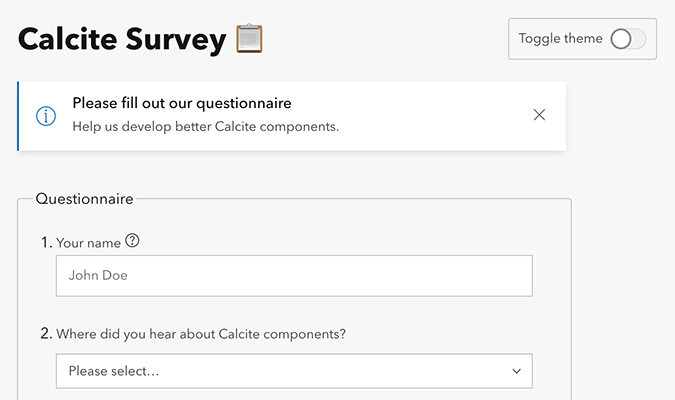

<!-- .slide: data-background="../node_modules/esri-reveal.js-templates/img/2021/dev-summit/bg-1.png" data-background-size="cover" -->

# Esri's Design System

#### Build Compelling Web Apps Faster Using the New Web Component Library

<h2 style="display: flex; gap: 14px; justify-content: center;"><calcite-avatar scale="l" full-name="Matt Driscoll" thumbnail="./img/matt.jpeg"></calcite-avatar> Matt Driscoll – <a href="https://twitter.com/driskull" target="_blank">@driskull</a></h2>

<h2 style="display: flex; gap: 14px; justify-content: center;"><calcite-avatar scale="l" full-name="JC Franco" thumbnail="./img/jc.jpg"></calcite-avatar> JC Franco – <a href="https://twitter.com/arfncode" target="_blank">@arfncode</a></h2>

---

<!-- .slide: data-background="../node_modules/esri-reveal.js-templates/img/2021/dev-summit/bg-3.png" data-background-size="cover"  -->

## Agenda

- Introduction
- Benefits
- Building blocks
- Getting started
- Demo apps
- Custom theming
- Examples in the wild

---

<!-- .slide: data-background="../node_modules/esri-reveal.js-templates/img/2021/dev-summit/bg-3.png" data-background-size="cover"  -->

# Introduction

Getting to know Calcite components

---

## Calcite - Esri's design system

- Visual language
  - Design standards
    - Color, Spacing, Typography, icons...
  - Patterns & practices
  - Documentation
  - Reusable components
- Closes the gap between designers and UI engineers

---

<calcite-notice icon active scale="m" width="half" color="yellow">
  <div slot="notice-title">Disclaimer</div>
  <div slot="notice-message">We are <u>not</u> designers</div>
</calcite-notice>

---

<!-- .slide: data-background="../node_modules/esri-reveal.js-templates/img/2021/dev-summit/bg-2.png" data-background-size="cover"  -->

## Calcite components

- Web Components for Calcite Design System
  - 50+ web components
  - Provides a library of patterns
  - Ready-to-use, reusable
  - Internal & external use
    - [Developer subscription](https://next.sites.afd.arcgis.com/calcite-design-system/guide/licensing/) required
  - Easily build consistent Esri-branded apps

---

<!-- .slide: data-background="../node_modules/esri-reveal.js-templates/img/2021/dev-summit/bg-3.png" data-background-size="cover"  -->

# Benefits

Why use Calcite components?

---

## Consistency

- Consistent UX
  - Esri branded identity (look & feel)
  - Best practices
  - Conventions
- Clear direction for designers & developers

---

## Efficiency

- Reduced effort & cost
  - Apps follow agreed upon designs workflows
  - Reduce cost of design updates
  - Reusable
    - Stop reinventing the wheel
- Speed up development timelines

---

## Accessibility

- Follows [WCAG](https://www.w3.org/WAI/standards-guidelines/wcag/) (W3 guidelines)
  - Semantics
  - Keyboard access
  - Color contrast
  - Text alternatives
- Continuous Integration (CI) using [axe API](https://www.deque.com/)

---

## Standards-based

- Web components
  - W3C specification (future-proof)
  - Encapsulation (Shadow DOM)
  - Familiarity (HTML)
  - Framework agnostic (can be used in any framework)

---

## Modern browser Support

<table>
  <thead>
    <tr>
      <th><h4>Chrome</h4></th>
      <th><h4>Firefox</h4></th>
      <th><h4>Safari</h4></th>
      <th><h4>Edge</h4></th>
    </tr>
  </thead>
  <tbody>
    <tr>
      <td colspan="4">Last 2 versions ✔</td>
    </tr>
  </tbody>
</table>

---

<!-- .slide: data-background="../node_modules/esri-reveal.js-templates/img/2021/dev-summit/bg-3.png" data-background-size="cover"  -->

# Building blocks

Dissecting Calcite components

---

## Building Blocks

- [Calcite Colors](https://github.com/Esri/calcite-colors)
  - Esri's official color palette
  - Light/Dark theme
- [Calcite Styles](https://github.com/Esri/calcite-styles)
  - Sizing, Spacing, Color, Typography, Shadows...
  - [tailwindcss](https://tailwindcss.com/)
- [Calcite UI icons](https://github.com/Esri/calcite-ui-icons)
  - 700+ UI SVG icons

---

<!-- .slide: data-background="../node_modules/esri-reveal.js-templates/img/2021/dev-summit/bg-3.png" data-background-size="cover"  -->

# Demo: Building blocks

[Explore building blocks](https://next.sites.afd.arcgis.com/calcite-design-system/)

---

<!-- .slide: data-background="../node_modules/esri-reveal.js-templates/img/2021/dev-summit/bg-3.png" data-background-size="cover"  -->

# Getting Started

Using Calcite components for your projects

---

## Web components

- Web standard
- APIs
- Tooling
  - [Stencil](https://stenciljs.com/)
  - [Tailwind CSS](https://tailwindcss.com/) (Our design tokens)

---

## Web Components (what?)

- Suite of different technologies
- Allows you to create reusable custom elements
  - Functionality encapsulated
  - Utilize them in your web apps
- Built on web standards
- Supported by modern browsers

---

## Web Components (how?)

- Custom elements
  - Browser-compatible elements
  - Use native APIs
  - DOM element lifecycle
- Shadow DOM
  - Encapsulates component HTML & CSS
  - `<slot>` for distributing content

---

## Web Components (why?)

- Modularity
- Encapsulation
- Reusability
- Framework-agnostic\* ([most frameworks anyways 😅](https://custom-elements-everywhere.com/))

---

## Plug & Play

- Use as native HTML elements

<div class="r-stack">

```html
<label>
  Name (4 to 8 characters):
  <input minlength="4" maxlength="8" placeholder="John Doe" required />
</label>
```

  <!-- .element: class="fragment fade-out" data-fragment-index="0" -->

  <label>
    Name (4 to 8 characters):
    <input
      minlength="4"
      maxlength="8"
      placeholder="John Doe"
      required
    />
  </label>

  <!-- .element: class="fragment fade-out" data-fragment-index="0" -->

```html
<calcite-label layout="inline">
  Name (4 to 8 characters):
  <calcite-input
    min-length="4"
    max-length="8"
    placeholder="John Doe"
    required
  ></calcite-input>
</calcite-label>
```

  <!-- .element: class="fragment" data-fragment-index="0" -->

  <calcite-label layout="inline">
    Name (4 to 8 characters):
    <calcite-input
      min-length="4"
      max-length="8"
      placeholder="John Doe"
      required
    ></calcite-input>
  </calcite-label>

  <!-- .element: class="fragment" data-fragment-index="0" -->

</div>

[Demo](https://codepen.io/jcfranco-the-scripter/pen/BaQeOzr?editors=1000)

---

## Configuring components

- Slots
- Properties
- Attributes

---

## Slots

Components provide slots to customize certain regions

```html
<calcite-tip heading="My Tip">
  Okay Guy is a sullen-looking rage comic character...
</calcite-tip>
```

<div style="display:flex; height: 200px; align-items: center; justify-content: center;">
  <calcite-tip heading="My Tip">
    Okay Guy is a sullen-looking rage comic character...
  </calcite-tip>
</div>

---

## Slots

Components provide slots to customize certain regions

```html
<calcite-tip heading="My Tip">
  
  Okay Guy is a sullen-looking rage comic character...
</calcite-tip>
```

<div style="display:flex; height: 350px; align-items: center; justify-content: center;">
  <calcite-tip heading="My Tip">
    
    Okay Guy is a sullen-looking rage comic character...
  </calcite-tip>
</div>

---

## Themes

- `theme="dark"`

---

## RTL

- Right-to-left support
- `dir="rtl"`

---

## Internationalization

Component text is customizable via `intl` attributes/properties


---

## Internationalization

Component text is customizable via `intl` attributes/properties

```html
<calcite-modal ...> ... </calcite-modal>
```


---

## Internationalization

Component text is customizable via `intl` attributes/properties

```html
<calcite-modal ... intl-close="Cerrar"> ... </calcite-modal>
```


---

## Get the components

- [NPM](https://www.npmjs.com/package/@esri/calcite-components) / [Yarn](https://yarnpkg.com/package/@esri/calcite-components)
- [CDN](https://js.arcgis.com/calcite-components/)

---

<!-- .slide: data-background="../node_modules/esri-reveal.js-templates/img/2021/dev-summit/bg-3.png" data-background-size="cover"  -->

# Demo: Getting started

[](https://next.sites.afd.arcgis.com/calcite-design-system/guide/getting-started-developers/)

---

<!-- .slide: data-background="../node_modules/esri-reveal.js-templates/img/2021/dev-summit/bg-3.png" data-background-size="cover"  -->

# Create Esri branded apps

Building example applications

---

<!-- .slide: data-background="../node_modules/esri-reveal.js-templates/img/2021/dev-summit/bg-3.png" data-background-size="cover"  -->

## Demo: Calcite Components Form

[](https://codepen.io/driskull/pen/gOgPvaN?editors=1000)

---

<!-- .slide: data-background="../node_modules/esri-reveal.js-templates/img/2021/dev-summit/bg-3.png" data-background-size="cover"  -->

## Demo: Web mapping application

[](../demos/embedded-map?webmapId=6c1f105834964553bddd0e7e31439d11)

---

<!-- .slide: data-background="../node_modules/esri-reveal.js-templates/img/2021/dev-summit/bg-3.png" data-background-size="cover"  -->

# Custom Theming

Customizing Calcite's appearance

---

<!-- .slide: data-background="../node_modules/esri-reveal.js-templates/img/2021/dev-summit/bg-3.png" data-background-size="cover"  -->

## Themeable

- Style props for easy consistent styling

```html
<calcite-button
  appearance="outline"
  color="gray"
  scale="l"
  icon-end="play"
  round
>
  press play
</calcite-button>
```

<calcite-button appearance="outline" color="gray" scale="l" icon-end="play" round>
  press play
</calcite-button>

[Demo](https://codepen.io/jcfranco-the-scripter/pen/OJbYopZ?editors=1000)

---

<!-- .slide: data-background="../node_modules/esri-reveal.js-templates/img/2021/dev-summit/bg-3.png" data-background-size="cover"  -->

## Themeable

- CSS variables for color are available too

```html
<calcite-loader
  active
  style="--calcite-ui-brand: green; --calcite-ui-brand-press: yellow; --calcite-ui-brand-hover: red;"
>
</calcite-loader>
```

<calcite-loader active style="--calcite-ui-brand: green; --calcite-ui-brand-press: yellow; --calcite-ui-brand-hover
: red;"></calcite-loader>

[Demo](https://esri.github.io/calcite-components/?path=/story/overview-custom-theme--interactive-example)

---

<!-- .slide: data-background="../node_modules/esri-reveal.js-templates/img/2021/dev-summit/bg-3.png" data-background-size="cover"  -->

# Examples in the wild

Apps out there using Calcite components

---

## Map Viewer

[](https://www.esri.com/arcgis-blog/products/arcgis-online/mapping/try-out-the-new-map-viewer-beta/)

---

## Recap

- Introduced Calcite components
- Benefits
- Building blocks
- Getting started
- Demo apps
- Custom theming
- Examples in the wild

---

## Calcite Sessions

- [Build Beautiful, Consistent Web Apps Faster](https://www.esri.com/en-us/about/events/devsummit/agenda/agenda/detail?q=design+system&date=2021-04-06)
  - Julie Powell, Julio Ochoa
- [Designing Applications Faster with UI Kits and Components](https://www.esri.com/en-us/about/events/devsummit/agenda/agenda/detail?q=design+system&date=2021-04-08)
  - Adam Tirella, Bryan Stifle

---

## Additional Resources

- [Mozilla: Web Components](https://developer.mozilla.org/en-US/docs/Web/Web_Components)
- [GitHub: Calcite Components](https://github.com/Esri/calcite-components/)
- [Stencil.js](https://stenciljs.com/)

---

# Questions? 🤔

> Where can I find the slides/source?

[bit.ly/componentsds21](https://bit.ly/componentsds21)

> Where can I submit a question?

[bit.ly/askcalcite](https://bit.ly/askcalcite)

---

<!-- .slide: data-background="../node_modules/esri-reveal.js-templates/img/2021/dev-summit/bg-5.png" data-background-size="cover" -->


---

<!-- .slide: data-background="../node_modules/esri-reveal.js-templates/img/2021/dev-summit/bg-5.png" data-background-size="cover" -->

Please provide your feedback for this session by clicking on the session survey link directly below the video

<!-- .element: style="margin: 0 20%;" -->
